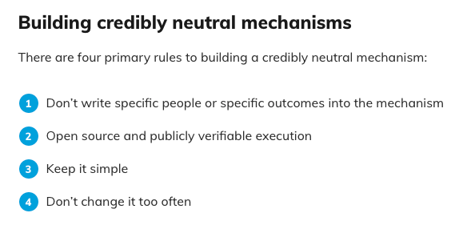
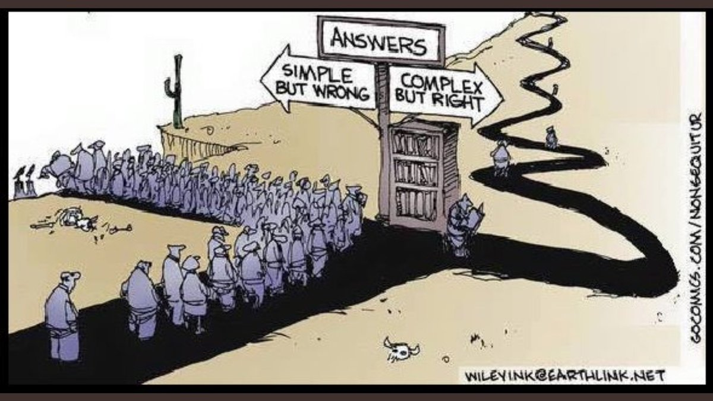

Over the last couple of years, I've been fascinated at how cool cryptoeconomics really is! In a few words, cryptoeconomics
is the combination of cryptography with economic incentives - in a perfect world, we should be able to do everything by relying
only on cryptography. However, that is *not* entirely possible and, therefore, 
we [also have to rely on economic incentives](https://youtu.be/ycK3AUTdl1w) (see around the 17-minute mark of 
this video that provides a brilliant overview by Justin Drake of the field).

The fact that it is a new multidisciplinary field that combines Economics with Computer Science
makes it *really* interesting to me - especially considering the potential to affect almost every
area of society.

<ins>**Through this post, I will attempt to cover the following topics:**</ins>
- explain what **cryptoeconomics** *really* is and its potential applications / use cases (*hint*: DeGov);
- give my perspective on why I think cryptoeconomics marks the beginning of a *new* **Industrial Revolution** ("Industry 4.0" as some people might call it);
- justify my reasoning why I believe **mechanism design** is so important to build sustainable systems;
- describe the details that make **social coordination** the most important tool at our disposal.
- portray why **Ethereum** is the global settlement layer behind all of these concepts.

### <ins>A Paradigm Shift</ins> 

A *paradigm shift* is best defined by [Thomas Khun](https://en.wikipedia.org/wiki/Thomas_Kuhn)
as "a fundamental change in the basic concepts and experimental practices of a scientific discipline".
In other words, it represents a [major change in society](https://www.investopedia.com/terms/p/paradigm-shift.asp) and is often associated with the rise of 
a new technology.

One clear example of a paradigm shift is the invention of the Internet, which [occurred around the 80s](https://www.usg.edu/galileo/skills/unit07/internet07_02.phtml) 
and changed the way we communicate (i.e. transfer of information).

We can establish a relationship between the definition of a paradigm shift and the 
[History of Industrial Revolution](https://en.wikipedia.org/wiki/Industrial_Revolution).
Industrial Revolutions are *always* caused by 

#### Industrial Revolutions in Modern History

Name              | Years                | Name              | Causes / Technology
--------------------- | --------------------- | --------------------- | ---------------------
First Industrial Revolution                 | End of 18th century         | "The Industrial Revolution"     | Introduction of water and steam-powered mechanical manufacturing facilities
Second Industrial Revolution  | Start of 20th century | "Technological Revolution" | Introduction of electrically-powered mass production based on the division of labour
Third Industrial Revolution | Start of 1970s | "Digital Revolution" | Uses electronics and IT to achieve further automation of manufacturing (transfer of information)
Fourth Industrial Revolution | 2009 - *present* | Industry 4.0 or 4IR | Uses blockchain technology to transfer all sorts of value, secured by cryptography

The same way that the Internet changed the way we exchange information, we can consider that blockchain
technology is changing the way we transfer value - therefore, by definition, it is fair to consider it to be
a paradigm shift technology ([with the implications that *it* carries](http://www.ee.scu.edu/eefac/healy/kuhn.html)).

Considering the [four "revolutions"](https://kfactory.eu/short-history-of-manufacturing-from-industry-1-0-to-industry-4-0/) mentioned in the table above, I believe that our current one has the potential to **become the most [disruptive](https://en.wikipedia.org/wiki/Disruptive_innovation)**
(i.e. affect the most sectors in society, including traditional governance mechanisms and hierarchies).

Also, with each phase, we can observe that a new technology appears and creates a [more effective
way of generating even more value and innovation](https://www.kellogg.northwestern.edu/faculty/rebelo/htm/finland.pdf) - 
it's a cycle because knowledge is a public good and, therefore, it has the important properties of being [non-rival](https://en.wikipedia.org/wiki/Rivalry_(economics)) 
and [non-excludable](https://en.wikipedia.org/wiki/Excludability) (I'm not considering IP rights here, which would make *knowledge* partially excludable).

*Fun fact #1*: [Endogenous growth models](https://www.jstor.org/stable/2138581) were always a fascinating area of study to me in college.

### <ins>Mechanism Design</ins> 

As we've seen before, cryptoeconomics and the new paradigm are **all about incentives**. What is the field of science that
studies incentives? That's right - it's [Game Theory](https://en.wikipedia.org/wiki/Game_theory)!

Even more fascinating and interesting that Game Theory is something called [Mechanism Design](https://en.wikipedia.org/wiki/Mechanism_design), 
which is also known as *"Reverse Game Theory"*.

I'm a strong believer of the power of Mechanism Design to build [credible-neutral systems](https://nakamoto.com/credible-neutrality/), 
that can give *fair* opportunities to all participants of the game. In a way, it is already happening through
the creation of many mechanisms, such as [quadratic funding](https://www.radicalxchange.org/concepts/quadratic-funding/),
[quadratic/intensity voting](https://www.radicalxchange.org/concepts/quadratic-voting/), [prediction markets](https://augur.net/), 
[retroactive public goods funding](https://medium.com/ethereum-optimism/retroactive-public-goods-funding-33c9b7d00f0c) and a couple other mechanisms. 

Many mechanism designers believe that we can use incentives and game theory to change the world for the positive. I'll showcase
my intellectual 4-step model on how we can use Mechanism Design for positive-sum games:

  [1] Design rules for a credible-neutral system;

  [2] Implement the mechanism (experiment if it works);

  [3] Iterate the implementation until it works at a small scale;

  [4] Once it works, extrapolate it to bigger agglomerates (adoption phase which might include "smart cities").

In my personal opinion, step [1] is the most important one, and it is *critical* to follow these rules that [Vitalik mentioned](https://nakamoto.com/credible-neutrality/):

Out of this four rules, I would argue that "keeping it simple" might be the most important principle to follow. [Simplicity is the
ultimate sophistication](https://www.goodreads.com/quotes/9010638-simplicity-is-the-ultimate-sophistication-when-once-you-have-tasted) 
and having few parameters to manage a complex dynamic system is *not* an easy task to accomplish. The concept of ["Illusory superiority"](https://en.wikipedia.org/wiki/Illusory_superiority)
also comes to my mind here, mixed with the concept of [intellectual underconfidence](https://vitalik.ca/general/2021/02/18/election.html), as we 
sometimes tend to overthink and over-complicate things in order to showcase more than we are required to. 

**It's a bit of a paradox, because in order to achieve *great* things we must follow complex paths. However,
"keeping it simple" is the most important principle. The trick is to follow Naval's advice: 
["It is the mark of a genius to explain a complex topic in a simple way"](https://twitter.com/NavalismHQ/status/1420285393887326210).
Simplifying complex processes is one of the greatest skills one can have.**

My advice: take the right lane but keep a clear mind and simplify along the way

So my advice here would be very much like in software engineering: [KISS](https://en.wikipedia.org/wiki/KISS_principle) and 
design with [modularity](https://en.wikipedia.org/wiki/Modular_programming) (the [advantages of modularity in programming](http://gwentechembedded.com/the-advantages-of-modular-software-and-programming/) also
apply to mechanism design - if you're multidisciplinary you *know* that the **principles from one
area always apply to other areas** and that's one of the reasons why Ethereum has so many bright individuals)!

*Fun fact #2*: I’ve always been a huge Kanye West fan and, when I was younger, there was a quote from him that always stuck with me. 
He said, during a [Harvard presentation](https://www.youtube.com/watch?v=r1MmyP1Jjhc), in 2013, 
that [“the world can be saved through design”](https://www.dezeen.com/2013/11/19/the-world-can-be-saved-through-design-says-kanye-west-at-harvard-graduate-school-of-design/ ). 
And he repeated this idea several [more times](https://www.akendi.com/blog/design-will-save-the-world/). 
He was *absolutely* right – as he is in many cases. However, **we will save the world through mechanism design** – which is still a form of design! Thanks, Ye. 

### <ins>DAOs and Smart Cities</ins> 

TBD (soon)
